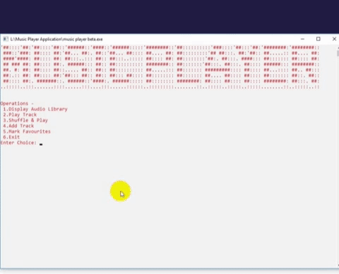

# Music-Player-Console-Application-in-C++-
An application to organize and play musical tracks along with corresponding artworks using **OOP** concepts and **Win32 API (Windows Multimedia).**

This project has been developed in response to my first introduction to Object Oriented Programming course.The basic concept that has been implemented is just out of my curiousity and interest.I didn't have any knowledge of GUI by then so I did it in console.

---
### Environment Setup

- Import Headers  
    - From WinBGIm_GCC47 folder, copy _graphics_ and _winbgim_ header files, goto `C:\Program Files (x86)\CodeBlocks\MinGW\include` and paste them
    - From WinBGIm_GCC47 folder, copy _libbgi.a_
     goto `C:\Program Files (x86)\CodeBlocks\MinGW\lib` and paste it

- Configure Codeblocks
    - From **codeblocks IDE**, goto _Settings > Compiler > Linker Settings_.
   Click on <kbd>Add</kbd>, write _"winmm"_ and then press OK.

- Link Libraries
	- From **WinBGIm_GCC47** folder,open 'linker.txt' and copy all the contents.
   	- From codeblocks IDE, goto _Settings > Compiler > Linker Settings_.	`
   	- Under _other linker options_, paste the copied text
   	- Under _Link Libraries_, click <kbdAdd</kbd>,click browse and select `C:\Program Files (x86)\CodeBlocks\MinGW\lib`

---

### FAQ

#### 1. What does **TrackInfo** file do?
TrackInfo is a _CSV file_ that contains all the track information in the format "TRACK_NAME, ALBUM_NAME, ALBUM_COVER_TITLE"

#### 2. How do I add my new track to the library?
In order to add a new track in the library, paste the track **(WAV format)** in _Audio Library_ subfolder and Cover art **(JPG)** in _Album Covers_ subfolder, then add the track related information by pressing <kbd>option 6</kbd> in the program or directly editing the _TrackInfo_ text file.

##### NOTE: Added track title should be followed by 'wav' and cover art should be followed by 'jpg' extension.

#### 3. The tracks are not playing properly.HELP!
If the track doesn't play by itself, please uncomment (remove '//' characters) the `system("pause")` statement in **LINE 68** of _music player beta.cpp_ file.
